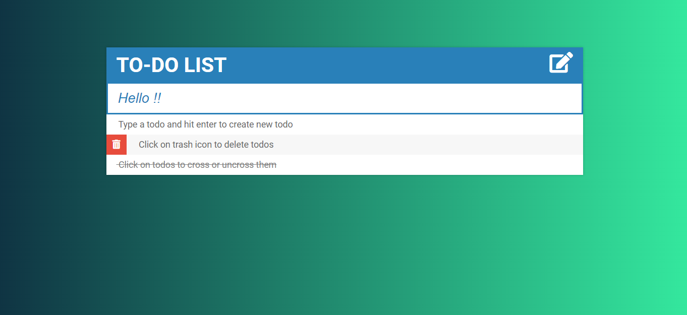

# ToDo-List-HTML-Project

Basic to do list where you can add and delte tasks to be performed and you can cross or uncross tasks depending upon their status of completion.
A bug has to be fixed where height of todos increase when text content increases.

